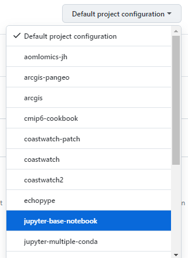

# Codespace(DevContainer) Generator

This project automates the setup of GitHub Codespaces by dynamically generating development container configurations (devcontainer.json) for each Docker container listed in a GitHub organization's package registry. 

## Contact:
- Michael.Akridge@noaa.gov 

## Usage
Deploy workflows in github repository where you need to set up Codespaces dynamically based on container images of a particular organization.
- ### Note:
  - ### Current setup is a very basic example and modification of the github actions and the "generate-devcontainers.js" file is needed for devcontianer needs.
  - The actions use Org "nmfs-opensci" as an example
### Enhance packages.json (and codesapce) via functions in the github actions(01-list-packages.yml) like so:
```
function determineExtensions(name) {
    // Add logic to determine extensions based on the package name
    if (name.includes("python")) return ["ms-python.python"];
    if (name.includes("r-base")) return ["ms-toolsai.jupyter"];
    return [];
}
function determinePorts(name) {
    // Add logic to determine ports based on the package name
...

}
function determinePostCreateCommand(name) {
    // Add logic to determine postCreateCommand based on the package name
...
}

``` 
## Github Actions
### 01-list-packages.yml - Will list all the available container packages from a specific github organization (nmfs-opensci) and saves to "packages.json" file
```
name: 01 | List and Save GitHub Package Info
on:
  workflow_dispatch:
  # schedule:
  #   - cron: '0 0 * * *' # Run daily
jobs:
  list-packages:
    runs-on: ubuntu-latest
    steps:
      - name: Checkout code
        uses: actions/checkout@v3

      - name: List packages and write to file
        env:
          GITHUB_TOKEN: ${{ secrets.GIT_API_TOKEN }}
        run: |
          echo "Listing container packages for the organization nmfs-opensci"
    
          # Fetch and save raw JSON
          curl -L \
            -H "Accept: application/vnd.github+json" \
            -H "Authorization: Bearer $GITHUB_TOKEN" \
            -H "X-GitHub-Api-Version: 2022-11-28" \
            "https://api.github.com/orgs/nmfs-opensci/packages?package_type=container" > packages.json

      - name: Commit and push if changes
        run: |
          git config --global user.email "action@github.com"
          git config --global user.name "GitHub Action"
          git add packages.json
          git commit -m "Updated package list for GitHub Page using curl" || echo "No changes to commit"
          git push
```
### 02-gen-dev-cons.yml  - Will generates devcontainer files based on github package container registry list(packages.json). Runs the "generate-devcontainers.js" file
```
const fs = require('fs');

// Load the packages data
const packages = JSON.parse(fs.readFileSync('packages.json', 'utf8'));

packages.forEach(pkg => {
  // Extract the part after "container-images/"
  const shortName = pkg.name.split('container-images/')[1];
  const devContainerConfig = {
    name: `Environment for ${pkg.name}`,
    image: `ghcr.io/nmfs-opensci/${pkg.name}:latest`,
    settings: { 
      "terminal.integrated.shell.linux": "/bin/bash"
    },
    extensions: [
    ],
    forwardPorts: [8888],
    postCreateCommand: "echo 'Environment ready!'"
  };

  // Directory for each package
  const dir = `./.devcontainer/${shortName}`;
  if (!fs.existsSync(dir)){
    fs.mkdirSync(dir, { recursive: true });
  }

  fs.writeFileSync(`${dir}/devcontainer.json`, JSON.stringify(devContainerConfig, null, 2));
});

console.log('Generated devcontainer.json files for all packages.');
```
## Github Aciton Setup
1. Setup Actions on Repo
    - Under Settings > Actions > General > Workflow Permissions > Enable Read and Write Permissions
2. Setup API Key 
    - https://github.com/settings/tokens
    - generate a key that has at least "read:packages" permissions
3. Add key to Repo
    - Under Repo, settings > secrets > actions > add key from step 2
    - Name it as 'GIT_API_TOKEN', or Update list-packages action env variable key name
## Note
- Github actions are currently manually run. Update github actions to run on a schedule, on update of dockerfiles, or more

----------
#### Disclaimer
This repository is a scientific product and is not official communication of the National Oceanic and Atmospheric Administration, or the United States Department of Commerce. All NOAA GitHub project content is provided on an ‘as is’ basis and the user assumes responsibility for its use. Any claims against the Department of Commerce or Department of Commerce bureaus stemming from the use of this GitHub project will be governed by all applicable Federal law. Any reference to specific commercial products, processes, or services by service mark, trademark, manufacturer, or otherwise, does not constitute or imply their endorsement, recommendation or favoring by the Department of Commerce. The Department of Commerce seal and logo, or the seal and logo of a DOC bureau, shall not be used in any manner to imply endorsement of any commercial product or activity by DOC or the United States Government.

##### License
See the [LICENSE.md](./LICENSE.md) for details
